# Task1 :API
I learned what APIs (Application Programming Interfaces) are and how they work. APIs allow different applications to communicate with each other by providing a way to request and receive data. I used the **WeatherAPI** and **Geolocation API** in my project, which helped me understand how to make API calls, use API keys for authentication, and process the data received in JSON format. This made me realize how APIs simplify adding real-time features like weather updates to applications.
For weather api:
https://github.com/Lahari-nagaraj/weatherapi

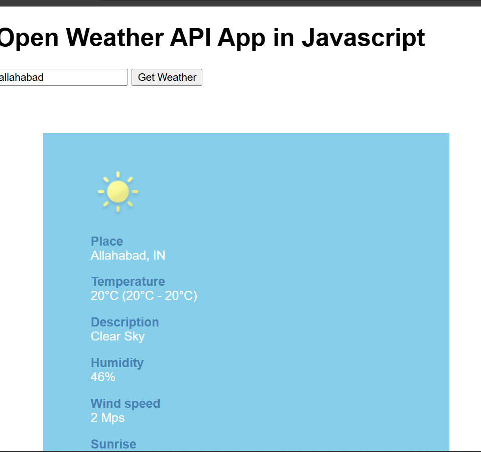

# Task:Working with Github

I learned to use GitHub for collaborative development. I worked with Git commands like clone, commit, push, and pull to track changes. I also forked a repository, made changes, and submitted a pull request, gaining practical experience in contributing to projects.

I explored GitHub Actions, Issues, and pull requests, understanding how they streamline teamwork and automate workflows. This task improved my understanding of version control and GitHub’s role in managing projects efficiently.
https://github.com/Lahari-nagaraj/git-task

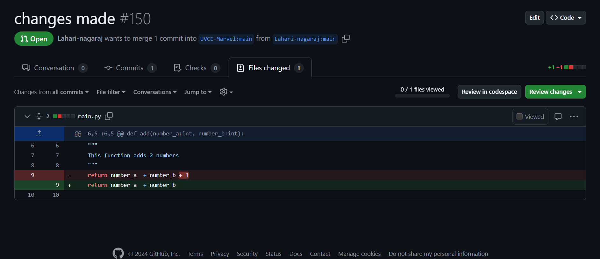

# Task: Command line on ubuntu

I gained hands-on experience with the Linux command line. I learned basic commands like mkdir to create folders, cd to navigate directories, and touch to create blank files. I practiced listing files using ls and creating multiple folders efficiently using loops. 

I also learned to use the cat command to concatenate two text files and display their contents directly in the terminal. This task helped me understand the power and flexibility of the Linux command line for managing files and automating repetitive tasks

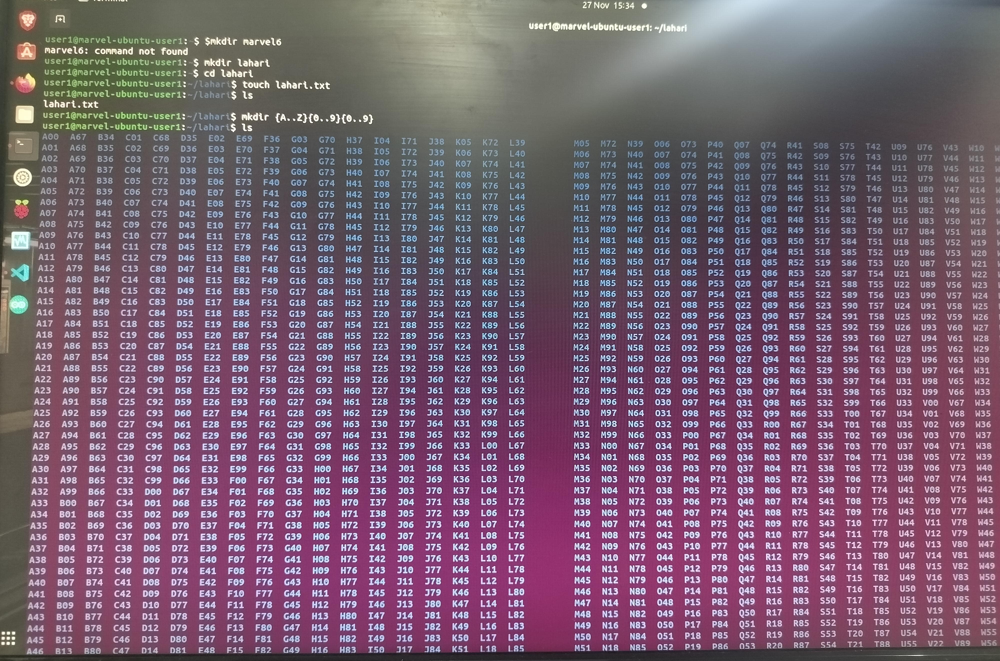

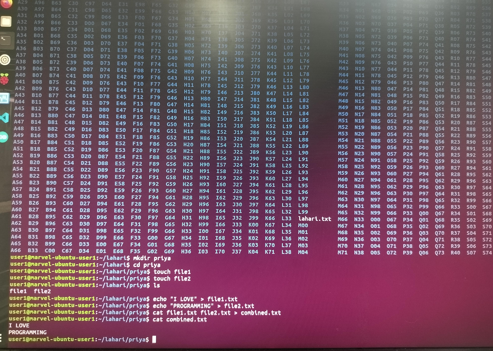

# Task:Kaggle Contest

I created a Kaggle account and participated in the Titanic ML competition, which involved predicting passenger survival based on data such as age, gender, and class. Through this challenge, I learned to preprocess data by handling missing values, encoding categorical variables, and normalizing features. I built and tested basic machine learning models like logistic regression and decision trees to make predictions.

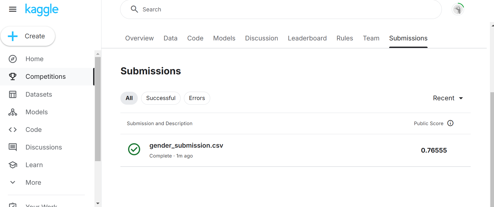

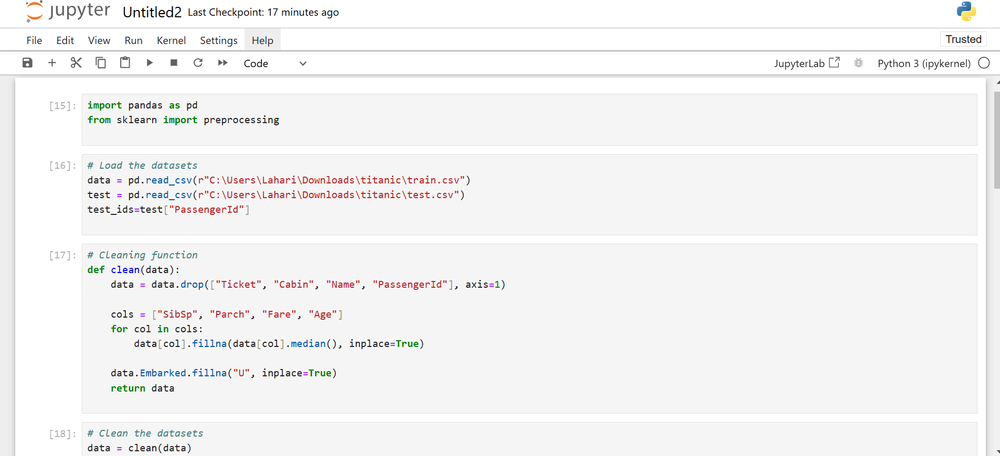
This competition introduced me to the Kaggle platform, including how to submit predictions, analyze results, and use the leaderboard for performance comparison. It provided a strong foundation in data handling and machine learning workflows, helping me understand the practical steps involved in building predictive models.

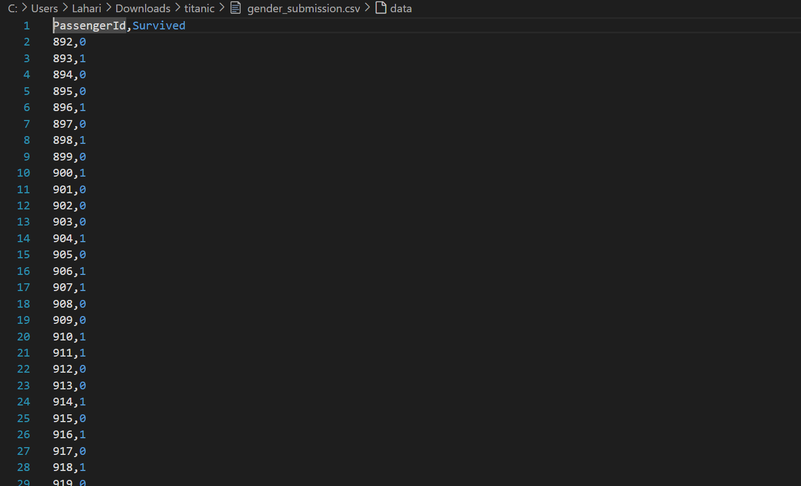

# Task: Working with Pandas and Matplotlib

 I used a dataset from Kaggle to explore data visualization with Pandas and Matplotlib. I learned the basics of Pandas for data manipulation, such as loading data, filtering, and organizing it for analysis. Using this prepared data, I created a line graph to show trends, a bar graph to compare categories, and a scatter plot to visualize relationships between variables.

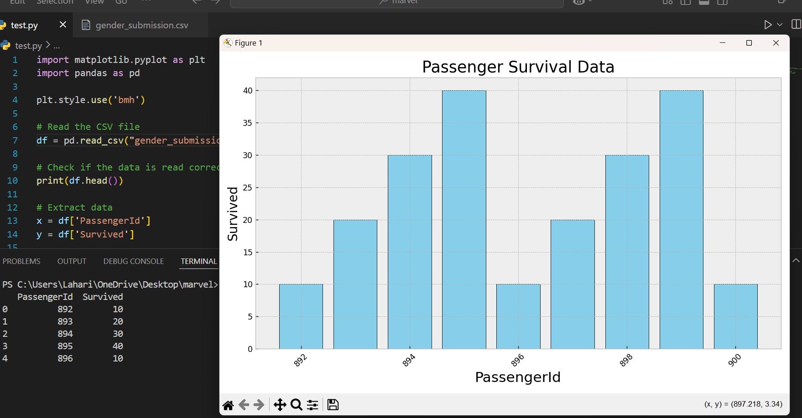

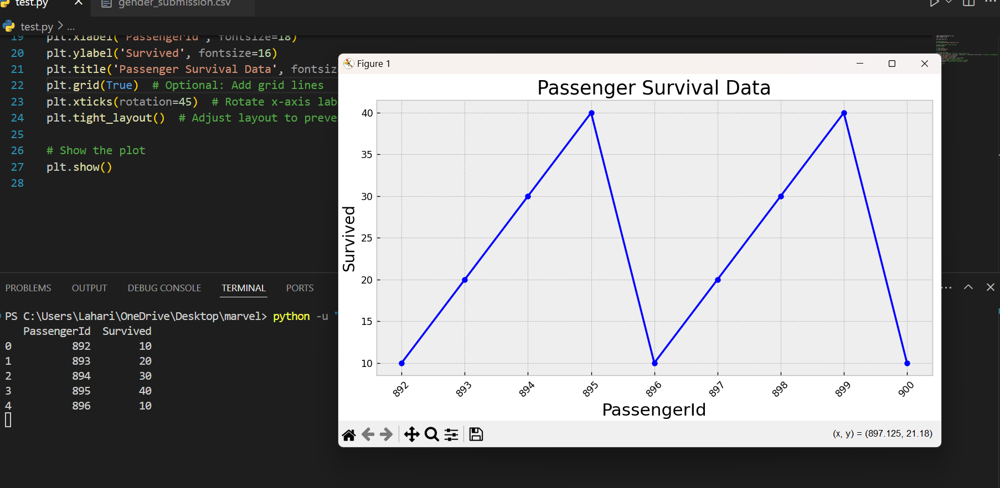

This task introduced me to the foundational concepts of Pandas and Matplotlib, helping me understand how to preprocess data and create meaningful visualizations. It also improved my ability to analyze and interpret data effectively through graphical representations.

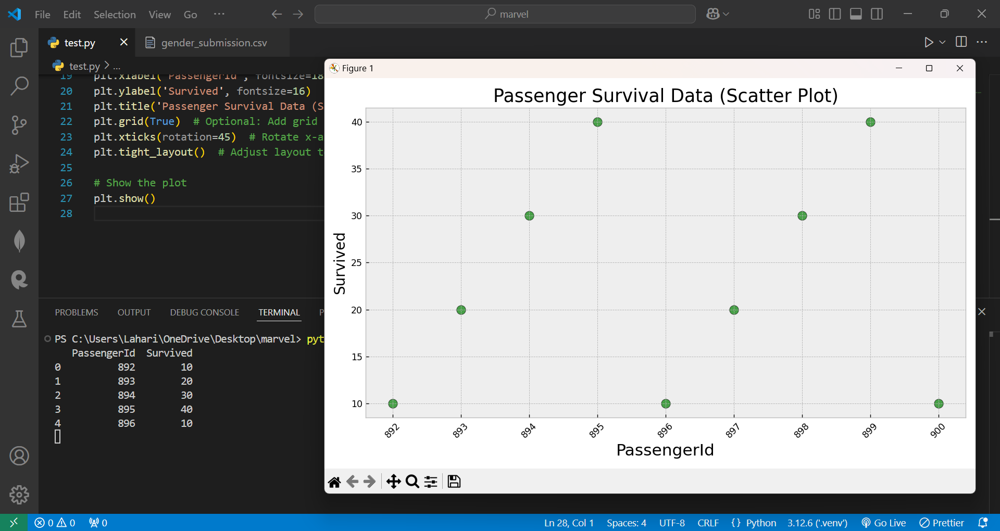

# Task : Writing resource Article Using Markdown

 I wrote a technical resource article titled "APIs in Today's World" and hosted it on the MARVEL website. Through this, I learned the basics of Markdown, including how to format headings, create bulleted and numbered lists, insert links, and add emphasis to text. Writing the article helped me understand how Markdown simplifies formatting without requiring complex HTML tags.

This task gave me practical experience in using Markdown to create clean, readable content that displays consistently across devices. It also deepened my knowledge of APIs and their importance, as I explored the topic while writing the article.

https://hub.uvcemarvel.in/article/baa76ee6-ea1f-451d-8567-597ca7134fe0

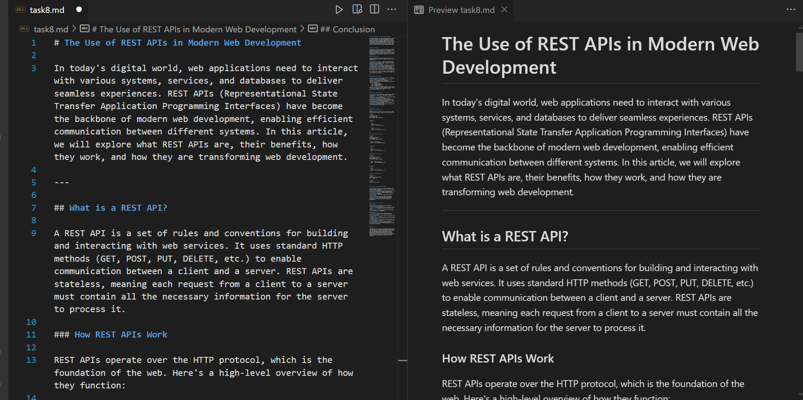

# Task: Tinkercad

I created a Tinkercad account and explored its features, gaining an introduction to circuit simulation. I learned how to work with an ultrasonic sensor and a servo motor to build a radar system. The ultrasonic sensor measured the distance to objects by emitting sound waves and detecting their reflection, while the servo motor rotated the sensor to cover a wider area. I displayed the results on the serial monitor, observing real-time data.

This task helped me understand the basics of Tinkercad, the functioning of ultrasonic sensors, and the concept of radar technology. It was a fascinating experience to simulate a circuit and see the distance detection mechanism in action.

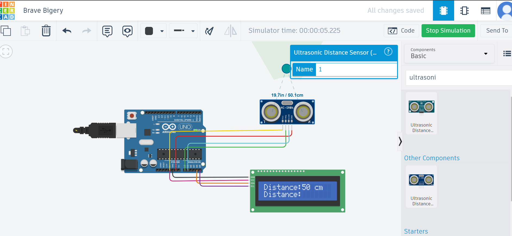

# Task: LED Toggle Using ESP32

I learned the basics of the ESP32 microcontroller and how to set up a standalone web server to control an LED connected to its GPIO pins. Using the Arduino IDE, I configured the environment and uploaded a simple program to the ESP32. Though it was challenging to understand the hardware initially, I managed to grasp the basic concepts and complete the setup.

This task introduced me to the fundamentals of working with the ESP32 and using it for simple IoT applications. It provided a good starting point for exploring hardware programming and web-based device control.

# Task : Soldering 

I learned about the basics of soldering and the equipment used, including the soldering iron, solder, soldering wick, and flux. Under the guidance of a coordinator, I practiced soldering on a perf board by creating a simple LED circuit. This involved carefully connecting components, applying solder to secure them, and using the soldering wick to correct any mistakes.

This task helped me understand the tools and techniques required for soldering and the importance of precision and safety during the process. It was a valuable hands-on experience that provided a strong foundation for working with electronic circuits.

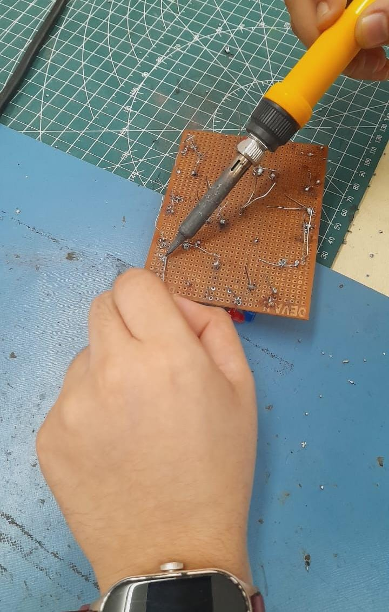

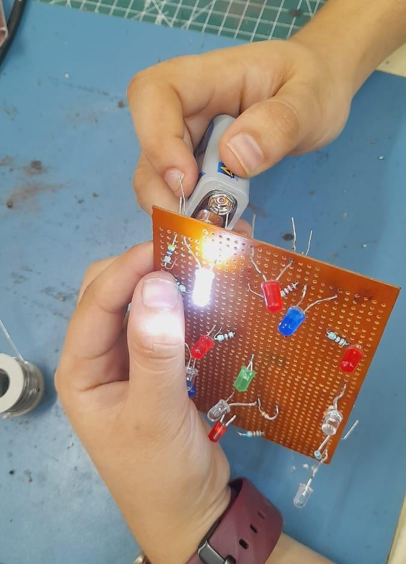

# Task: K-Maps

I explored the use of Karnaugh Maps (K-maps) to simplify logic expressions for a burglar alarm system. By analyzing four scenarios based on door lock/open and key pressed/not pressed, I created a K-map to derive the minimized logic expression. Using this expression, I designed a circuit with logic gates that controlled a buzzer or LED to blink when specific conditions were met. Push buttons were used to simulate the door and key inputs.

This task enhanced my understanding of logic gates, K-map simplification, and their practical application in creating functional circuits. It was an insightful experience that bridged theoretical concepts with hands-on implementation.

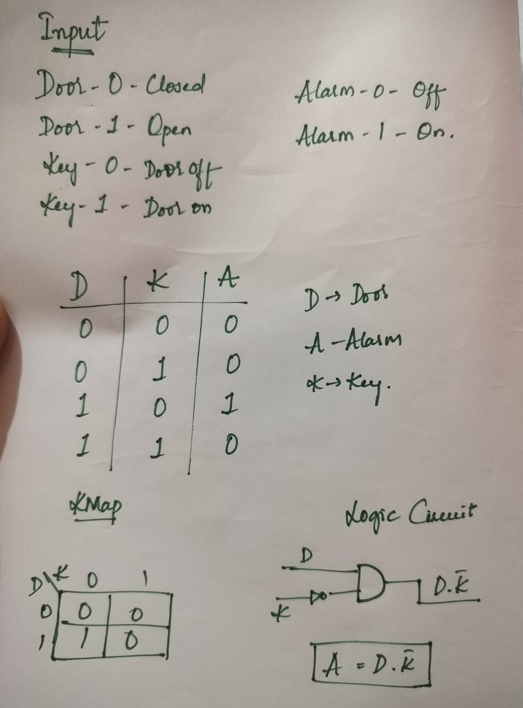

# Task:Active Participation

I took part in a few Hackathons and student conferences 

# Task:Datasheets report writing

I studied the datasheet of the MQ135 gas sensor and wrote a detailed report on its working, calibrations for detecting various gases, and the Freundlich Absorption Theorem graph. The report also covered the ICs used in L293D, the concept of PWM (Pulse Width Modulation), and the H-bridge circuit. These components and concepts were explored in the context of their applications in controlling devices and processing sensor data.

The report was hosted on the MARVEL website, helped me learn how to interpret datasheets, understand sensor calibrations, and present technical details in a structured format.

https://hub.uvcemarvel.in/article/3e741582-852b-44e3-8411-ee1f18c56c9e

# Task:Sad servers: "Like leetcode for Linux"

I explored Sad Servers, which is a platform designed to test and improve Linux troubleshooting skills. I worked through a scenario called "Command Line Murders," where I was tasked with troubleshooting Linux commands to solve problems. Before diving into the challenges, I familiarized myself with basic Linux commands and operations, which helped me understand the problem-solving process better.

This task provided me with a brief but valuable introduction to Linux command-line troubleshooting. It gave me practical experience in diagnosing issues and using commands to resolve them, which enhanced my confidence in working with Linux systems.

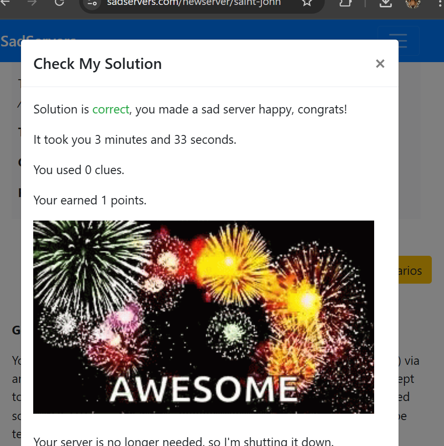

# Task: Make a webApp

I developed a real-time Android device tracker that displays device locations on a world map. Using technologies like Node.js, Express, Socket.io, and Leaflet, I integrated live tracking functionality that updates device positions in real-time. The world map was used to visualize the device's location globally, enhancing the user experience.

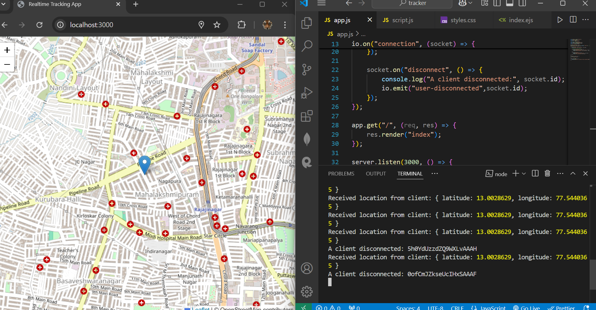

This project helped me learn how to combine mobile tracking with real-time data updates and map integration, providing valuable insights into full-stack development and geolocation-based applications.

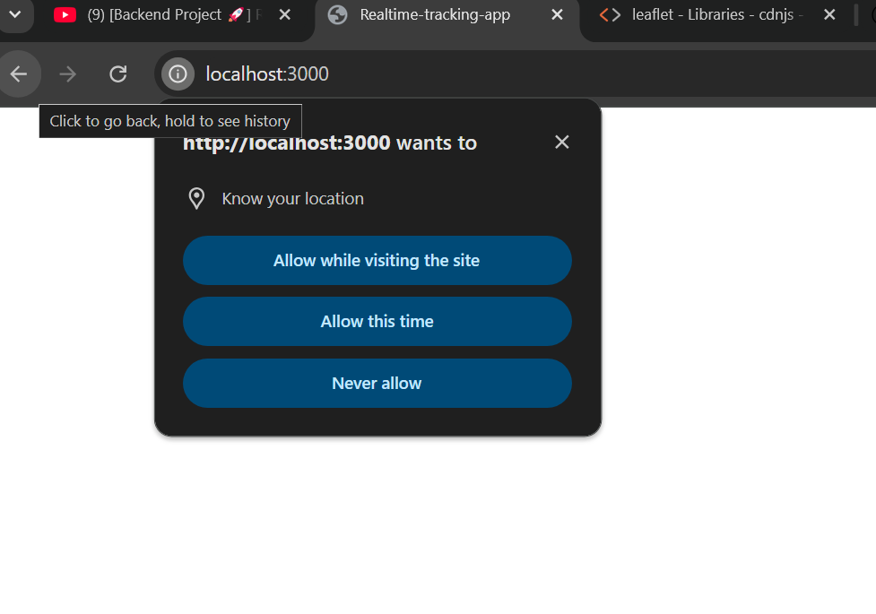

# Task: Create a Portfolio Website

I created a responsive portfolio webpage to showcase my skills, projects, and social media profiles. Using HTML, CSS, and a framework like Bootstrap, I designed the site to be functional on both desktop and mobile.

After completing the webpage, I pushed it to a Git repository, making it publicly accessible. This task helped me improve my web development skills and provided a platform to present my work.